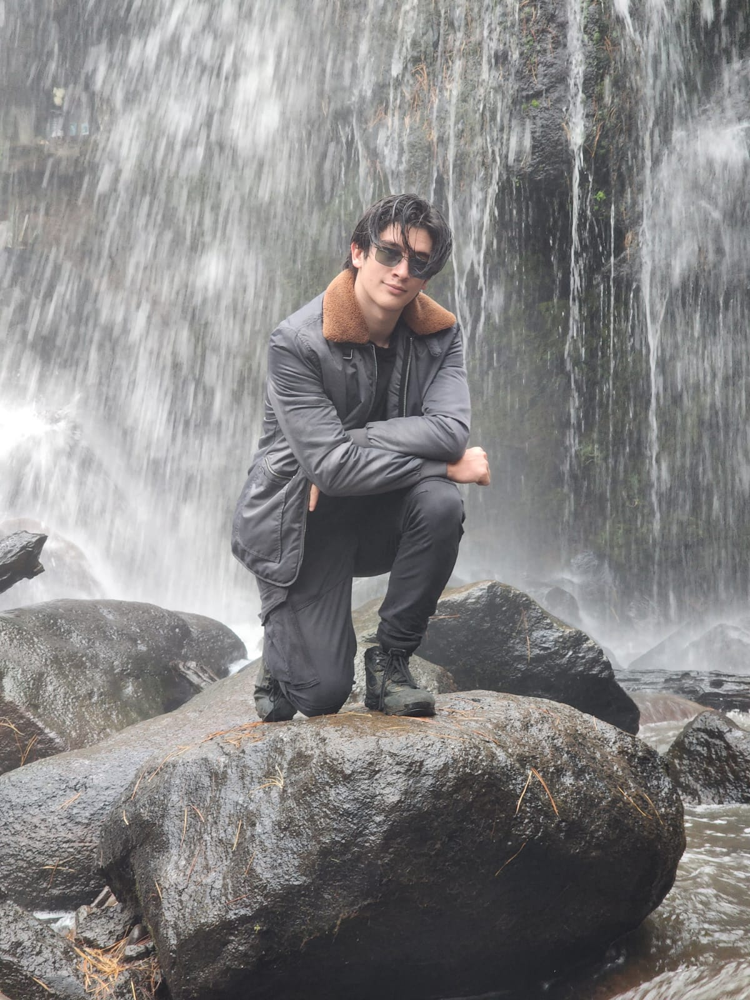

# Quien soy?
Mi nombre es Sebastián Gómez Rodríguez, tengo 18 años, soy de Puebla-Puebla de la universidad Iberoamericana de Puebla, en el cual soy un estudiante de primer semestre en mecatronica.

## Contacto
Correo: 204486@iberopuebla.mx

Número: +522215290319


```

## Mis intereses
Algunos de mis intereses son acerca de los deportes, computacion, construcción y/o reparación de aparatos electrónicos, instrumentos musicales, tomar fotografias, surfeo, ski, t y los videojuegos.

## Mis logros
Unos de mis logros son 3er lugar en las Olimpiadas nacionales de mexico como Puebla,3 años seguidos ganando Interjecuiticos con el Instituto Oriente de Puebla certificado de programacion de camaras de seguridad, buceo, fotografo de Munio 2024-2025 y medallista de 3er lugar en taekwondo.

### Universidad Iberoamericana

```

[Pagina de la Universidad.](https://www.iberopuebla.mx/)